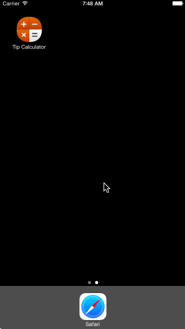

tipcalculator
=============

This is an iOS application that calculates the tip and total bill amount based on tip percentage and bill amount.

Time spent to complete this project: 6 hours

Completed user stories:
  - Required: tip calculator view where user can calculate tip amount and total
  - Required: navigation bar
  - Required: settings view where user can choose a default tip percentage amount
  - Optional: bill amount is persisted if app is restarted within 5 minutes
  - Optional: settings view has a light/dark color theme
  - Optional: added app icon and fixed app name

Walkthrough of user stories:

GIF created with [LiceCap].

iOS app icon by [DesignBolts].

[LiceCap]:http://www.cockos.com/licecap/
[DesignBolts]:http://www.icons101.com/iconset/setid_2354/iOS8_Cirtangle_Concept_by_DesignBolts
